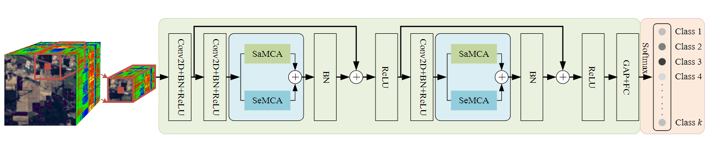
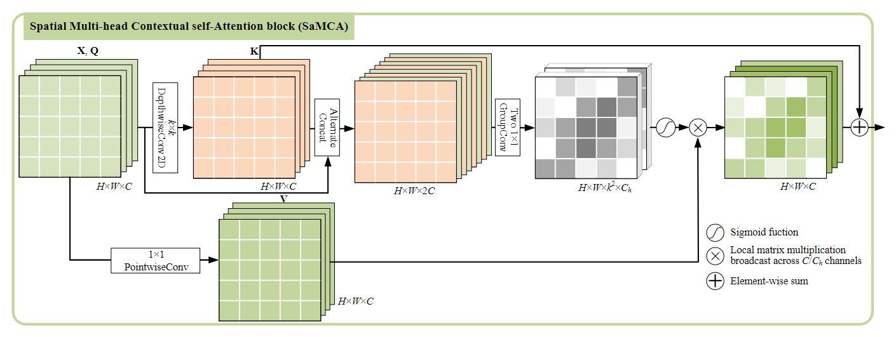
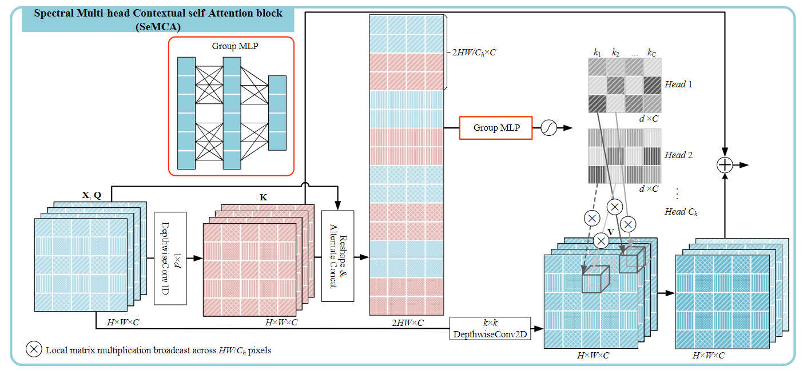

# About this paper
A Dual Multi-head Contextual Attention Network for Hyperspectral Image Classification

**Publish** www.mdpi.com/journal/remotesensing

The detailed of DMuCA can be seen in the [A Dual Multi-head Contextual Attention Network for Hyperspectral Image Classification](https://www.mdpi.com/2072-4292/14/13/3091).


If our code is helpful to you, please cite 

`Liang M, He Q, Yu X, Wang H, Meng Z, Jiao L. A Dual Multi-Head Contextual Attention Network for Hyperspectral Image Classification. Remote Sensing. 2022; 14(13):3091. `

# Network:



<center>Figure 1. The structure of the DBDA network. <center>



<center>Figure 2. The structure of the SaMCA block. <center>



<center>Figure 3. The structure of the SeMCA block. <center>


# Dataset

You can specify the dataset to be loaded by using the `--dataset` option.
Dataset to train. Available:

1. PaviaU
2. IdianPines
3. Houston

If you want to train on the  dataset, please use the following command in the terminal.

```
python main.py --dataset IndianPines --lr 0.005 --epoch 100  --run 1 --training_percentage 0.10 --class_balancing --patch_size 11 
```